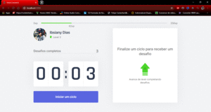

<h1 align="center">
     Moveit - Ibsiany
    </img>
</h1>
<h1 align="center">
    
    </img>
</h1>

# Indice
- [Sobre](#-sobre)
- [Tecnologias utilizadas](#-tecnologias-utilizadas)
- [Sobre o sistema](#-sobre-o-sistema)
- [Como baixar o projeto](#-como-baixar-o-projeto)

## 👀 Sobre

O projeto **Moveit Ibsiany** foi realizado na Next Level Week e é uma técnica pomodoro com desafios a serem cumpridos e níveis a serem alcançados.

---

## 💻 Tecnologias utilizadas

Foram utilizadas as seguintes tecnologias:

- [ReactJS](https://pt-br.reactjs.org/)
- [NodeJS](https://nodejs.org/en/)

---

## 📲 Sobre o sistema

No site você poderá realizar as seguintes funções:

- Técnica pomodoro
- Desafios nas pausas da técnica pomodoro
- Avançar de nível

---

## 📁 Como baixar o projeto 

Siga os seguintes passos para baixar o arquivo:

- Inicie o git em uma pasta reservada na sua máquina e digite 
```js
git clone https://github.com/Ibsiany/moveit.git
```
- acesse a pasta do arquivo e rode:
```js
npm install
```
